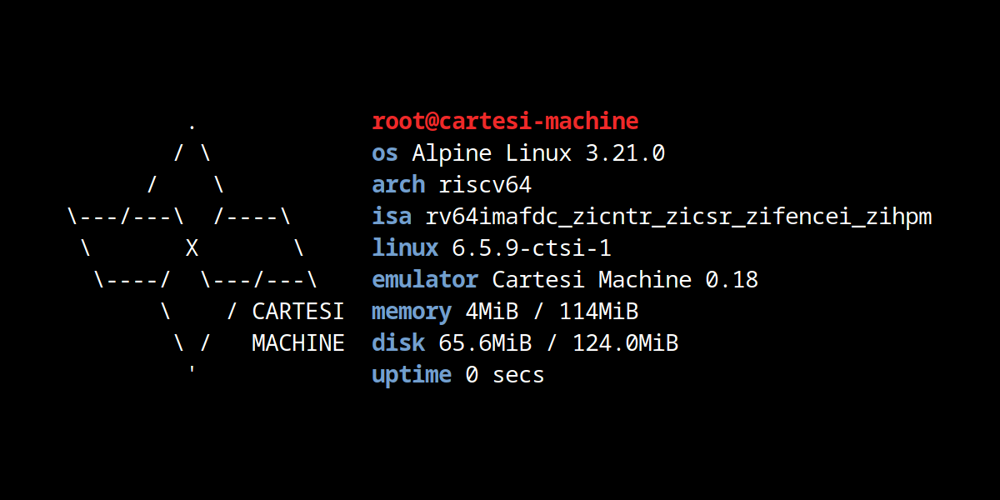

# WebCM

WebCM is a serverless terminal that runs a virtual Linux directly in the browser by emulating a RISC-V machine.

It's powered by the
[Cartesi Machine emulator](https://github.com/cartesi/machine-emulator),
which enables deterministic, verifiable and sandboxed execution of RV64GC Linux applications.

It's packaged as a single 24MiB WebAssembly file containing the emulator, the kernel and Alpine Linux operating system.

[](https://edubart.github.io/webcm/)

Try it now by clicking on the image above.

## Building

Assuming you have Docker installed and also set up to run `riscv64` via QEMU, just do:

```sh
make
```

It should build required dependencies and ultimately `webcm.mjs` and `webcm.wasm` which are required by `index.html`.

## Testing

To test locally, you could run a simple HTTP server:

```sh
python -m http.server 8080
```

Then navigate to http://127.0.0.1:8080/

## How it works?

The Cartesi Machine emulator library was compiled to WASM using Emscripten toolchain.
Then a simple C program instantiates a new Linux machine and boots in interactive terminal.

To have a terminal in the browser the following projects were used:

- https://github.com/mame/xterm-pty
- https://xtermjs.org
